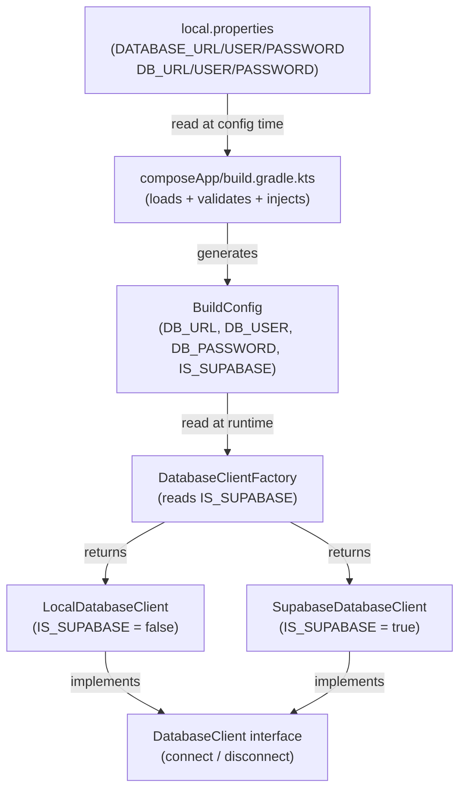

# Design Document: env-credential-switching

## Overview

This feature wires environment-specific database credentials into the Android build pipeline so that debug builds automatically connect to a local PostgreSQL instance and release builds connect to Supabase — with no credentials ever hardcoded or committed to version control.

The mechanism has three layers:

1. **Gradle configuration time** — `composeApp/build.gradle.kts` reads `local.properties`, validates the required keys for each build type, and injects them as `BuildConfig` string constants plus an `IS_SUPABASE` boolean flag.
2. **Compile time** — `BuildConfig` (generated by AGP) exposes `DB_URL`, `DB_USER`, `DB_PASSWORD`, and `IS_SUPABASE` as typed constants available to Kotlin source code.
3. **Runtime** — `DatabaseClientFactory` reads `BuildConfig.IS_SUPABASE` and returns either a `LocalDatabaseClient` or a `SupabaseDatabaseClient`, both of which implement the common `DatabaseClient` interface.

### Key Mapping

The requirements document uses logical names (`LOCAL_DB_*`, `SUPABASE_DB_*`). The actual keys already present in `local.properties` differ. The design maps them as follows:

| Logical name (requirements) | Actual key in `local.properties` | Used in build type |
|-----------------------------|----------------------------------|--------------------|
| `LOCAL_DB_URL`              | `DATABASE_URL`                   | `debug`            |
| `LOCAL_DB_USER`             | `DATABASE_USER`                  | `debug`            |
| `LOCAL_DB_PASSWORD`         | `DATABASE_PASSWORD`              | `debug`            |
| `SUPABASE_DB_URL`           | `DB_URL`                         | `release`          |
| `SUPABASE_DB_USER`          | `DB_USER`                        | `release`          |
| `SUPABASE_DB_PASSWORD`      | `DB_PASSWORD`                    | `release`          |

Both sets of keys are already present in `local.properties` and already excluded from version control via `.gitignore`. No changes to either file are required.

---

## Architecture



**Data flow summary:**

- `local.properties` → read by Gradle at configuration time
- Gradle validates keys and calls `buildConfigField(...)` for each build type
- AGP generates `BuildConfig.kt` with the injected constants
- At runtime, `DatabaseClientFactory.create()` branches on `BuildConfig.IS_SUPABASE`
- The returned `DatabaseClient` is used by the rest of the application

---

## Components and Interfaces

### Files modified

| File | Change |
|------|--------|
| `composeApp/build.gradle.kts` | Add `buildFeatures { buildConfig = true }`, load `local.properties`, add validation helper, inject fields in `debug` and `release` build types |

### Files created

| File | Purpose |
|------|---------|
| `composeApp/src/androidMain/kotlin/di/DatabaseClient.kt` | Common interface |
| `composeApp/src/androidMain/kotlin/di/LocalDatabaseClient.kt` | Debug implementation |
| `composeApp/src/androidMain/kotlin/di/SupabaseDatabaseClient.kt` | Release implementation |
| `composeApp/src/androidMain/kotlin/di/DatabaseClientFactory.kt` | Runtime factory |

### DatabaseClient interface

```kotlin
// composeApp/src/androidMain/kotlin/di/DatabaseClient.kt
package di

interface DatabaseClient {
    fun connect()
    fun disconnect()
}
```

### LocalDatabaseClient

```kotlin
// composeApp/src/androidMain/kotlin/di/LocalDatabaseClient.kt
package di

import org.scent.project.BuildConfig

class LocalDatabaseClient : DatabaseClient {
    override fun connect() {
        // TODO: establish JDBC connection using:
        //   url  = BuildConfig.DB_URL
        //   user = BuildConfig.DB_USER
        //   pass = BuildConfig.DB_PASSWORD
    }

    override fun disconnect() {
        // TODO: close JDBC connection
    }
}
```

### SupabaseDatabaseClient

```kotlin
// composeApp/src/androidMain/kotlin/di/SupabaseDatabaseClient.kt
package di

import org.scent.project.BuildConfig

class SupabaseDatabaseClient : DatabaseClient {
    override fun connect() {
        // TODO: establish JDBC connection using:
        //   url  = BuildConfig.DB_URL
        //   user = BuildConfig.DB_USER
        //   pass = BuildConfig.DB_PASSWORD
    }

    override fun disconnect() {
        // TODO: close JDBC connection
    }
}
```

### DatabaseClientFactory

```kotlin
// composeApp/src/androidMain/kotlin/di/DatabaseClientFactory.kt
package di

import org.scent.project.BuildConfig

object DatabaseClientFactory {
    fun create(): DatabaseClient =
        if (BuildConfig.IS_SUPABASE) SupabaseDatabaseClient()
        else LocalDatabaseClient()
}
```

---

## Data Models

### BuildConfig fields (generated by AGP)

| Field name  | Type      | Debug value                                    | Release value                                      |
|-------------|-----------|------------------------------------------------|----------------------------------------------------|
| `DB_URL`    | `String`  | value of `DATABASE_URL` from `local.properties` | value of `DB_URL` from `local.properties`          |
| `DB_USER`   | `String`  | value of `DATABASE_USER` from `local.properties`| value of `DB_USER` from `local.properties`         |
| `DB_PASSWORD` | `String` | value of `DATABASE_PASSWORD` from `local.properties` | value of `DB_PASSWORD` from `local.properties` |
| `IS_SUPABASE` | `Boolean` | `false`                                      | `true`                                             |

### build.gradle.kts changes

The full set of changes to `composeApp/build.gradle.kts`:

**1. Load `local.properties` at the top of the file (after the `plugins {}` block):**

```kotlin
import java.util.Properties

// Load local.properties
val localProperties = Properties().apply {
    val localPropsFile = rootProject.file("local.properties")
    if (!localPropsFile.exists()) {
        throw GradleException(
            "local.properties not found at ${localPropsFile.absolutePath}. " +
            "Create it with the required credential keys before building."
        )
    }
    localPropsFile.inputStream().use { load(it) }
}

// Helper: read a required key or fail with a clear message
fun requireProperty(key: String, buildType: String): String {
    val value = localProperties.getProperty(key)
    if (value.isNullOrBlank()) {
        throw GradleException(
            "Missing or empty required property '$key' in local.properties " +
            "(required for the '$buildType' build type)."
        )
    }
    return value
}
```

**2. Enable `BuildConfig` generation inside the `android {}` block:**

```kotlin
android {
    // ... existing config ...

    buildFeatures {
        buildConfig = true
    }

    buildTypes {
        getByName("debug") {
            buildConfigField("String",  "DB_URL",      "\"${requireProperty("DATABASE_URL",      "debug")}\"")
            buildConfigField("String",  "DB_USER",     "\"${requireProperty("DATABASE_USER",     "debug")}\"")
            buildConfigField("String",  "DB_PASSWORD", "\"${requireProperty("DATABASE_PASSWORD", "debug")}\"")
            buildConfigField("Boolean", "IS_SUPABASE", "false")
        }
        getByName("release") {
            isMinifyEnabled = false
            buildConfigField("String",  "DB_URL",      "\"${requireProperty("DB_URL",      "release")}\"")
            buildConfigField("String",  "DB_USER",     "\"${requireProperty("DB_USER",     "release")}\"")
            buildConfigField("String",  "DB_PASSWORD", "\"${requireProperty("DB_PASSWORD", "release")}\"")
            buildConfigField("Boolean", "IS_SUPABASE", "true")
        }
    }
}
```

> **Note:** The existing `getByName("release")` block already exists in the file — the `buildConfigField` calls are added inside it alongside the existing `isMinifyEnabled = false`.

---

## Correctness Properties

*A property is a characteristic or behavior that should hold true across all valid executions of a system — essentially, a formal statement about what the system should do. Properties serve as the bridge between human-readable specifications and machine-verifiable correctness guarantees.*

The majority of this feature is build-system configuration and stub implementations. Most acceptance criteria are SMOKE or INTEGRATION tests (build output verification, file existence checks). However, the `requireProperty` validation helper is a pure function with meaningful input variation, making it a good candidate for property-based testing.

### Property 1: requireProperty validation correctness

*For any* `Properties` object, key name string, and build type string: if the key is absent or its value is blank, `requireProperty` SHALL throw a `GradleException` whose message contains both the key name and the build type string; if the key is present and non-blank, `requireProperty` SHALL return the exact value stored under that key.

**Validates: Requirements 3.1, 3.2, 3.3**

---

## Error Handling

### Build-time errors

| Scenario | Behavior |
|----------|----------|
| `local.properties` file does not exist | `GradleException` thrown during configuration with the absolute path of the missing file |
| A required key is absent from `local.properties` | `GradleException` thrown with the key name and build type in the message |
| A required key is present but blank/empty | Same `GradleException` as above (the `isNullOrBlank()` check covers both cases) |

### Runtime errors

The `DatabaseClient` implementations are stubs. Error handling for actual JDBC connection failures (timeouts, auth errors, network issues) is deferred to the implementation phase when real connection logic is added to `connect()` and `disconnect()`.

---

## Testing Strategy

### Unit tests

The `requireProperty` helper is the only pure, testable logic introduced by this feature. It should be extracted into a testable form (e.g., a top-level function in a separate file or a Gradle plugin test) so it can be unit-tested independently of the build system.

Specific examples to cover:
- Key present with a non-blank value → returns the value
- Key absent → throws `GradleException` with key name in message
- Key present but empty string → throws `GradleException` with key name in message
- Key present but whitespace-only string → throws `GradleException` with key name in message
- Error message contains the build type string

### Property-based tests

**Library:** [kotest-property](https://kotest.io/docs/proptest/property-based-testing.html) (already a natural fit for Kotlin projects; integrates with JUnit 5)

**Property 1 test** — `requireProperty` validation correctness:

```kotlin
// Tag: Feature: env-credential-switching, Property 1: requireProperty validation correctness
checkAll(100, Arb.string(), Arb.string(), Arb.string()) { key, value, buildType ->
    val props = Properties().apply { setProperty(key, value) }
    if (value.isBlank()) {
        shouldThrow<GradleException> {
            requireProperty(props, key, buildType)
        }.message shouldContainAll listOf(key, buildType)
    } else {
        requireProperty(props, key, buildType) shouldBe value
    }
}
// Also test absent key:
checkAll(100, Arb.string(), Arb.string()) { key, buildType ->
    val props = Properties() // key not set
    shouldThrow<GradleException> {
        requireProperty(props, key, buildType)
    }.message shouldContainAll listOf(key, buildType)
}
```

Minimum 100 iterations per `checkAll` call.

### Integration tests

These verify build output and require actually running Gradle. They are manual or CI-only:

| Test | How to verify |
|------|---------------|
| Debug build injects local credentials | Run `./gradlew assembleDebug`, inspect generated `BuildConfig.kt` |
| Release build injects Supabase credentials | Run `./gradlew assembleRelease`, inspect generated `BuildConfig.kt` |
| Missing `local.properties` fails build | Remove file, run `./gradlew assembleDebug`, verify error message |
| Missing key fails build | Remove a key, run the relevant build variant, verify error message names the key |

### Smoke checks (manual, one-time)

- `local.properties` exists and contains all six credential keys
- `.gitignore` already excludes `local.properties` (confirmed — no change needed)
- `di/` directory exists at `composeApp/src/androidMain/kotlin/di/`
